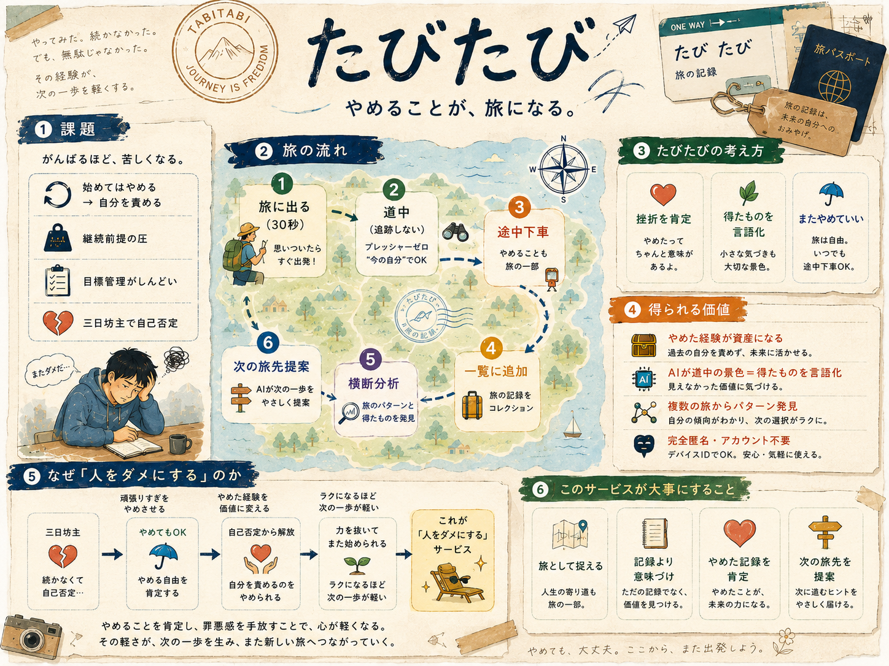
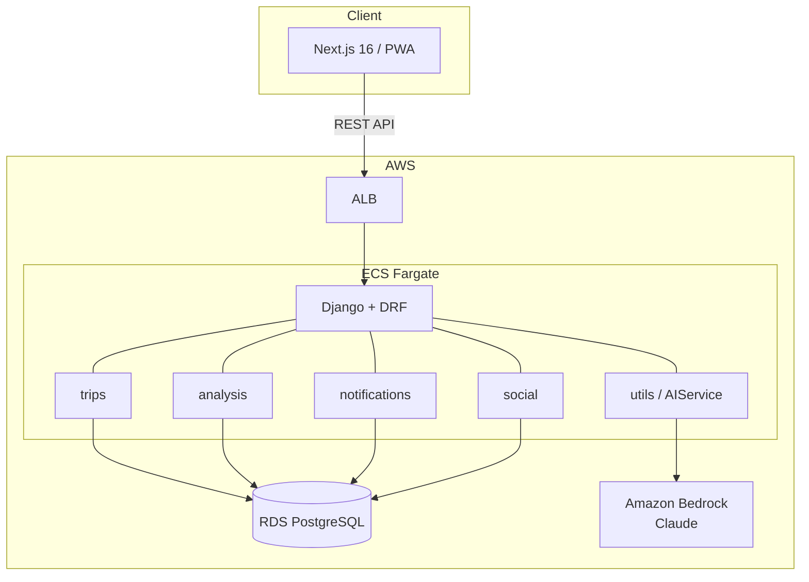

# たびたび

> やめることが、旅になる。



三日坊主を繰り返すほど、AIが「次に始めたら面白そうなこと」を提案してくれる。  
挫折を肯定し、ダメであるほどサービスが賢くなる構造を持つPWAアプリケーション。

---

## コンセプト

何かを始めてはやめる。また始めてはやめる。  
そのたびに「また続かなかった」と自分を責める。

**たびたび**は、その構造を逆転させる。

- 「やめた」は「途中下車」。目的地に着かなくても、歩いた道は存在する
- やめるたびにAIが「道中で見た景色（得たもの）」を言語化する
- 三日坊主を繰り返すほどデータが溜まり、パターンが見え、次の提案精度が上がる

**ダメなほど豊かになる。** それが「たびたび」。

---

## 体験フロー

```
旅に出る（30秒）→ 道中（追跡しない）→ 途中下車（やめる）→ 一覧に追加
                                                          ↓
                                          横断分析 → 次の旅先提案
```

1. **旅に出る** — テンプレート or 自由入力で宣言。AIが道標を生成。ゴール設定なし
2. **道中** — 管理・追跡しない。道標ベースの軽い通知のみ
3. **途中下車** — 自分から宣言 or フェードアウト後にそっと確認。AIが「得たもの」を言語化
4. **一覧画面** — 途中下車した旅がメイン画面。主要指標は「旅の数」
5. **横断分析** — 複数の旅からパターンを発見し、次の旅先を提案

---

## 具体例

> 筋トレ3日 + ランニング2日 + ヨガ1日 で途中下車
>
> → AI:「体を動かす系に何度も出かけてますね。"散歩"はどうですか？一番ハードル低いし、やめても景色は見てます」

> ギター1週間 + ピアノ3日 で途中下車
>
> → AI:「音楽の旅が多いですね。"鼻歌を録音する"だけの旅はどうですか？」

---

## 設計原則

| やること | 絶対にやらないこと |
|---|---|
| やめたことの価値を言語化する | 長く続けた人を褒める |
| 始めた回数を肯定する | 蓄積量（距離・日数）を比較する |
| 「またやめていい」前提で提案する | 「もっと続けられたはず」と示唆する |
| 30秒で始められる手軽さを保つ | 「次こそ続けよう」と圧をかける |

---

## アーキテクチャ



### 技術スタック

| レイヤー | 技術 |
|---|---|
| フロントエンド | Next.js 16（App Router, PWA, Service Worker） |
| バックエンド | Django 5 + Django REST Framework |
| データベース | Amazon RDS PostgreSQL |
| AI | Amazon Bedrock（Claude） |
| 通知 | PWA Push Notification |
| インフラ | AWS ECS Fargate + ALB + RDS |
| 認証 | 完全匿名（デバイスID、アカウント作成不要） |

### Django アプリ構成

| アプリ | 責務 |
|---|---|
| `trips` | 旅のライフサイクル（開始・道中・途中下車） |
| `analysis` | 横断分析・次の旅先提案 |
| `notifications` | プッシュ通知スケジューリング |
| `social` | 匿名タイムライン |

### 共通モジュール

| パッケージ | 責務 | 備考 |
|---|---|---|
| `utils` | AIService（Bedrock連携）・デバイス認証ミドルウェア | Django アプリではない。モデルなし |

---

## 開発ユニット

優先度ベースで3ユニットに分割し、順次開発する。

| # | ユニット | スコープ | ストーリー数 |
|---|---|---|---|
| 1 | 最小ループ（P1） | 旅に出る→途中下車→一覧 + 全インフラ基盤 | 10 |
| 2 | 横断分析（P2） | パターン発見 + 次の旅先提案 | 2 |
| 3 | 通知+ソーシャル（P3+P4） | プッシュ通知 + 匿名タイムライン | 3 |

Unit 2/3 は Unit 1 に依存。互いには独立。

---

## プロジェクト構成

```
aws-summit-japan-2026-hackathon/
├── backend/                # Django プロジェクト
│   ├── config/             # settings, urls, wsgi
│   ├── trips/              # 旅のライフサイクル
│   ├── analysis/           # 横断分析
│   ├── notifications/      # 通知
│   ├── social/             # ソーシャル
│   ├── utils/              # 共通モジュール（AIService, 認証）※Djangoアプリではない
│   └── manage.py
├── frontend/               # Next.js プロジェクト
│   ├── app/                # App Router
│   ├── components/         # 共有コンポーネント
│   ├── lib/                # API クライアント
│   └── public/
├── infra/                  # IaC
├── aidlc-docs/             # 設計ドキュメント（AI-DLC）
└── docker-compose.yml      # ローカル開発環境
```

---

## ネーミング

**たびたび** = 「度々（たびたび）」×「旅々」

何度もやめてしまう（度々）ことが、何度も旅に出ている（旅々）ことと同義になる。

---

## 設計ドキュメント

Inception フェーズの成果物は [`aidlc-docs/`](./aidlc-docs/) に格納:

- [要件定義](./aidlc-docs/inception/requirements/requirements.md)
- [ユーザーストーリー](./aidlc-docs/inception/user-stories/stories.md)
- [アプリケーション設計](./aidlc-docs/inception/application-design/application-design.md)
- [ユニット定義](./aidlc-docs/inception/units/unit-of-work.md)
