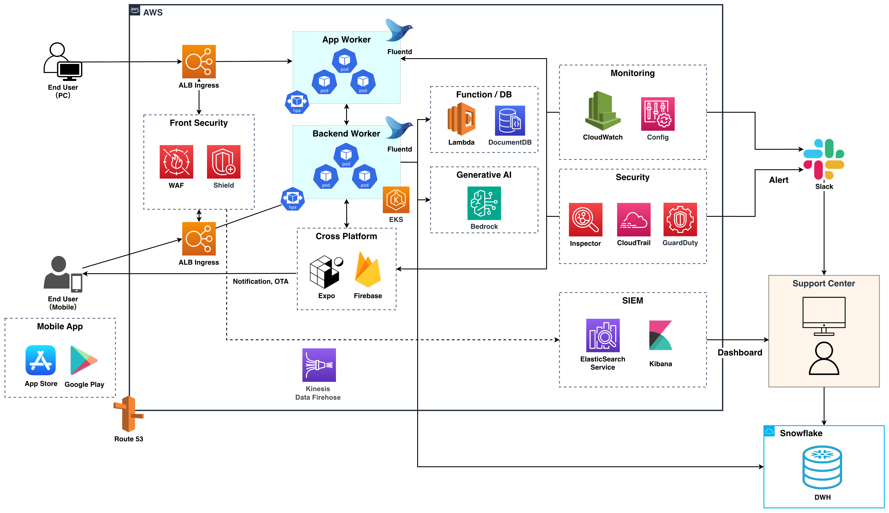

# たびたび

> やめることが、旅になる。


三日坊主を繰り返すほど、AIが「次に始めたら面白そうなこと」を提案してくれる。  
挫折を肯定し、ダメであるほどサービスが賢くなる構造を持つモバイルアプリケーション。

---

## コンセプト

何かを始めてはやめる。また始めてはやめる。  
そのたびに「また続かなかった」と自分を責める。

**たびたび**は、その構造を逆転させる。

- 「やめた」は「途中下車」。目的地に着かなくても、歩いた道は存在する
- やめるたびにAIが「道中で見た景色（得たもの）」を言語化する
- 三日坊主を繰り返すほどデータが溜まり、パターンが見え、次の提案精度が上がる

**ダメなほど豊かになる。** それが「たびたび」。

---

## 体験フロー

メインの体験は「三日坊主をそのまま肯定して記録する」流れ。旅メタファーは伝わる人にだけ刺さる比喩なので、まずストレートな書き方を示し、そのあとに旅メタファーでの言い換えを置く。

### 三日坊主の流れ（ストレート版）

```
思いついたら開始（30秒）→ ちょっと試す → やめる（合わなくてOK）→ 三日坊主として記録
                                                                       ↓
                                                  AIが意味づけ → 次のおためしを提案
```

1. **思いついたら開始** — テンプレート or 自由入力で宣言。AIが小さな区切りを生成。ゴール設定なし
2. **ちょっと試す** — 管理・追跡しない。軽いプッシュ通知のみ。「やっても、やらなくてもOK」
3. **やめる** — 自分から宣言 or 3日間無活動でそっと確認。AIが「そこで得たもの」を言語化
4. **三日坊主を記録** — やめたもの一覧がメイン画面。主要指標は「始めた回数」（多いほど豊か）
5. **AIが意味づけ** — 複数の三日坊主からパターン（飽きやすい / 体を動かしたい / 音楽が好き など）を発見
6. **次のおためしへ** — パターンに基づいてハードルの低い次の候補を提示。やめる前提でOK

### 旅メタファー版（言い換え）

```
旅に出る（30秒）→ 道中（追跡しない）→ 途中下車（やめる）→ 旅の記録に追加
                                                          ↓
                                          横断分析 → 次の旅先提案（あなたの方角）
```

| ストレートな言葉 | 旅メタファー |
|---|---|
| 何かを始める | 旅に出る |
| 試している間 | 道中 |
| やめる | 途中下車 |
| そこで得たもの | 道中で見た景色 / 通った道 |
| やめたもの一覧 | 旅の記録 |
| 次のおためし提案 | あなたの方角 |
| 始めた回数 | 旅の数 |

---

## 具体例

> 筋トレ3日 + ランニング2日 + ヨガ1日 で途中下車
>
> → AI:「体を動かす系に何度も出かけてますね。"散歩"はどうですか？一番ハードル低いし、やめても景色は見てます」

> ギター1週間 + ピアノ3日 で途中下車
>
> → AI:「音楽の旅が多いですね。"鼻歌を録音する"だけの旅はどうですか？」

---

## 設計原則

| やること | 絶対にやらないこと |
|---|---|
| やめたことの価値を言語化する | 長く続けた人を褒める |
| 始めた回数を肯定する | 蓄積量（距離・日数）を比較する |
| 「またやめていい」前提で提案する | 「もっと続けられたはず」と示唆する |
| 30秒で始められる手軽さを保つ | 「次こそ続けよう」と圧をかける |

---

## アーキテクチャ



### 技術スタック

| レイヤー | 技術 |
|---|---|
| モバイルアプリ | React Native + Expo（Managed Workflow） |
| アプリ配信 | Expo EAS Build / EAS Submit → App Store / Google Play |
| OTAアップデート | Expo Updates + Firebase |
| Web版 | React SPA（PC/ブラウザ向け、PoC段階では後回し） |
| バックエンド | Django REST Framework（EKS上の2 Deployment） |
| コンテナ管理 | Amazon EKS（Kubernetes）、HPA によるオートスケール |
| API公開 | ALB Ingress（Host-based routing） |
| データベース | Amazon DocumentDB（MongoDB互換） |
| AI | Amazon Bedrock（Claude） |
| DWH | Snowflake（横断分析・BI基盤、S3 → Snowpipe連携） |
| プッシュ通知 | Firebase Cloud Messaging（FCM） |
| セキュリティ | WAF + Shield + Inspector + GuardDuty + CloudTrail |
| 監視・ログ | Fluentd → Kinesis Data Firehose → Elasticsearch + Kibana |
| アラート | CloudWatch Alarm → SNS → Slack |
| DNS | Route 53 |
| IaC | AWS CDK（Python） |
| 認証 | 完全匿名（デバイスID、アカウント作成不要） |

### EKS Worker 構成

| Worker | 役割 | ルーティング |
|---|---|---|
| App Worker | Web版SPA配信 + Web向けAPI | web.tabitabi.example.com |
| Backend Worker | モバイルAPI + バッチ処理 + CronJob | api.tabitabi.example.com |

同じDRFプロジェクト、同じコードベース。環境変数 `WORKER_MODE` でモード切替。

### Django アプリ構成

| アプリ | 責務 |
|---|---|
| `trips` | 旅のライフサイクル（開始・道中・途中下車） |
| `analysis` | 横断分析・次の旅先提案 |
| `notifications` | プッシュ通知スケジューリング（FCM） |
| `social` | 匿名タイムライン |

### 共通モジュール

| パッケージ | 責務 | 備考 |
|---|---|---|
| `utils` | AIService（Bedrock連携）・デバイス認証ミドルウェア・Snowflakeエクスポート | Django アプリではない。モデルなし |

---

## 開発ユニット

機能ドメイン別に8ユニットに分割。バックエンド → フロントエンド → インフラの順で開発。

| # | ユニット | 種別 | 優先度 | スコープ |
|---|---|---|---|---|
| 1 | trips-backend | バックエンド | 最優先 | 旅のライフサイクル + 共通基盤（AIService, DeviceAuth） |
| 2 | analysis-backend | バックエンド | 高 | 横断分析と次の旅先提案 |
| 3 | notifications-backend | バックエンド | 中 | プッシュ通知スケジューリングとFCM送信 |
| 4 | social-backend | バックエンド | 低 | 匿名タイムライン |
| 5 | mobile-app | フロントエンド | 高 | React Native（Expo）モバイルアプリ |
| 6 | web-app | フロントエンド | 低（後回し） | React SPA Web版 |
| 7 | infrastructure-base | インフラ | 中 | EKS / DocumentDB / ALB / CDK基盤 |
| 8 | infrastructure-security-monitoring | インフラ | 低 | WAF / Shield / 監視 / Snowflake連携 |

### 依存関係

```
Phase 1 (バックエンド):
  Unit 1 (trips) ──→ Unit 2 (analysis)
                 ──→ Unit 3 (notifications)
                 ──→ Unit 4 (social)

Phase 2 (フロントエンド):
  Unit 5 (mobile) ──→ Unit 6 (web) [後回し]

Phase 3 (インフラ):
  Unit 7 (base) ──→ Unit 8 (security/monitoring)
```

Unit 2, 3, 4 は Unit 1 完了後に並行開発可能。

---

## プロジェクト構成

```
tabitabi/
├── backend/                # Django REST Framework プロジェクト
│   ├── config/             # settings, urls, wsgi
│   │   └── settings/      # base.py, development.py, production.py
│   ├── trips/              # 旅のライフサイクル
│   ├── analysis/           # 横断分析
│   ├── notifications/      # 通知
│   ├── social/             # ソーシャル
│   ├── utils/              # 共通モジュール（AIService, 認証, Snowflake）
│   ├── Dockerfile
│   └── requirements.txt
├── mobile/                 # React Native (Expo) モバイルアプリ
│   ├── src/
│   │   ├── navigation/     # Tab + Stack ナビゲーション
│   │   ├── screens/        # 画面コンポーネント
│   │   ├── components/     # 共通UIコンポーネント
│   │   ├── api/            # APIクライアント
│   │   └── hooks/
│   └── package.json
├── web/                    # React SPA（後回し）
│   ├── src/
│   └── package.json
├── infra/                  # AWS CDK (Python)
│   ├── stacks/             # networking, eks, documentdb, security, monitoring
│   ├── k8s/                # Kubernetes マニフェスト
│   └── cdk.json
├── aidlc-docs/             # 設計ドキュメント（AI-DLC）
└── docker-compose.yml      # ローカル開発環境
```

---

## ネーミング

**たびたび** = 「度々（たびたび）」×「旅々」

何度もやめてしまう（度々）ことが、何度も旅に出ている（旅々）ことと同義になる。

---

## v1 → v2 変更サマリー

| 項目 | v1 | v2 |
|---|---|---|
| コンピュート | ECS Fargate（Django） | EKS（App Worker + Backend Worker） |
| フロントエンド | Next.js PWA | React Native（Expo Managed）+ React SPA |
| データベース | RDS PostgreSQL | DocumentDB（MongoDB互換） |
| ORM | Django ORM | MongoEngine |
| 通知 | PWA Push（Service Worker） | FCM（Firebase Cloud Messaging） |
| バッチ実行 | ECS Scheduled Task | Kubernetes CronJob |
| セキュリティ | 最小限（PoC） | フル構成（WAF/Shield/Inspector/GuardDuty/CloudTrail） |
| 監視 | なし | Fluentd → Kinesis → Elasticsearch + Kibana |
| DWH | なし | Snowflake（S3 → Snowpipe） |
| IaC | なし | AWS CDK（Python） |
| Worker構成 | 単一サービス | App Worker + Backend Worker（1 DRF / 2 Deployment） |
| アラート | なし | Slack連携（SNS経由） |

---

## 設計ドキュメント

Inception フェーズの成果物は [`aidlc-docs/`](./aidlc-docs/) に格納:

- [要件定義](./aidlc-docs/inception/requirements/requirements.md)
- [ユーザーストーリー](./aidlc-docs/inception/user-stories/stories.md)
- [アプリケーション設計](./aidlc-docs/inception/application-design/application-design.md)
- [ユニット定義](./aidlc-docs/inception/application-design/unit-of-work.md)

AI-DLC プロセスの実践記録:

- [AI-DLC 進捗状態](./aidlc-docs/aidlc-state.md) — フェーズ進捗・拡張ルール適用判定
- [意思決定履歴（audit ログ）](./aidlc-docs/audit.md) — 全段階の質問・確定・承認の時系列記録
