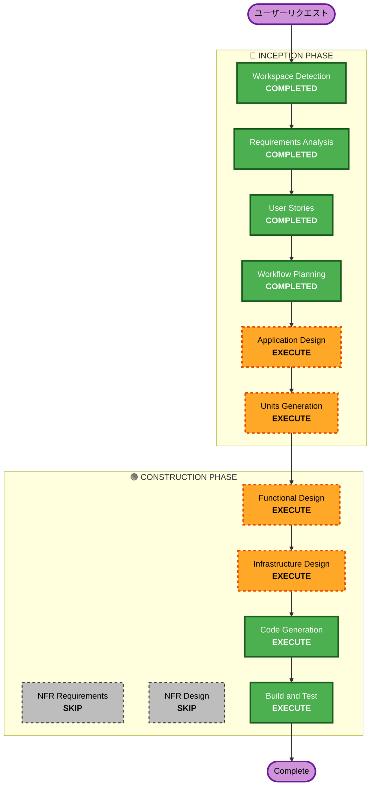

# Execution Plan

## Detailed Analysis Summary

### Change Impact Assessment
- **User-facing changes**: Yes — 全機能が新規ユーザー向け（PWA全画面）
- **Structural changes**: Yes — 新規アーキテクチャ構築（ECS Fargate + RDS構成）
- **Data model changes**: Yes — PostgreSQLスキーマ新規設計
- **API changes**: Yes — REST API全エンドポイント新規（Django REST Framework）
- **NFR impact**: Low — PoC規模、基本的なパフォーマンス要件のみ

### Risk Assessment
- **Risk Level**: Low-Medium
- **Rollback Complexity**: Easy（新規プロジェクト、既存システムへの影響なし）
- **Testing Complexity**: Moderate（AI連携のテストが必要）

## Workflow Visualization



### Text Alternative
```
Phase 1: INCEPTION
  - Workspace Detection (COMPLETED)
  - Requirements Analysis (COMPLETED)
  - User Stories (COMPLETED)
  - Workflow Planning (COMPLETED)
  - Application Design (EXECUTE)
  - Units Generation (EXECUTE)

Phase 2: CONSTRUCTION
  - Functional Design (EXECUTE)
  - NFR Requirements (SKIP)
  - NFR Design (SKIP)
  - Infrastructure Design (EXECUTE)
  - Code Generation (EXECUTE)
  - Build and Test (EXECUTE)

Phase 3: OPERATIONS
  - Operations (PLACEHOLDER)
```

## Phases to Execute

### 🔵 INCEPTION PHASE
- [x] Workspace Detection (COMPLETED)
- [x] Reverse Engineering (SKIPPED — Greenfield)
- [x] Requirements Analysis (COMPLETED)
- [x] User Stories (COMPLETED)
- [x] Workflow Planning (IN PROGRESS)
- [ ] Application Design - EXECUTE
  - **Rationale**: 新規コンポーネント（Frontend, Backend API, AI Service, Data Layer, Notification Service）の設計が必要。コンポーネント間の依存関係とメソッド定義が必要。
- [ ] Units Generation - EXECUTE
  - **Rationale**: 複数サービス/モジュール（PWA Frontend, Django Backend on ECS Fargate, AI Integration）への分解が必要。優先度に基づく実装順序の決定。

### 🟢 CONSTRUCTION PHASE
- [ ] Functional Design - EXECUTE
  - **Rationale**: PostgreSQLスキーマ設計、AI連携のビジネスロジック（道標生成、横断分析、次の旅先提案）の詳細設計が必要。
- [ ] NFR Requirements - SKIP
  - **Rationale**: PoC規模（〜100人）。基本的なパフォーマンス要件（30秒以内の操作、10秒以内のAI応答）は要件定義で十分カバー済み。セキュリティ拡張もスキップ決定済み。
- [ ] NFR Design - SKIP
  - **Rationale**: NFR Requirementsをスキップするため、NFR Designも不要。
- [ ] Infrastructure Design - EXECUTE
  - **Rationale**: AWS構成（ECS Fargate, ALB, RDS PostgreSQL, Bedrock, PWA Push Notification）の詳細設計が必要。
- [ ] Code Generation - EXECUTE (ALWAYS)
  - **Rationale**: 実装コード生成が必要。
- [ ] Build and Test - EXECUTE (ALWAYS)
  - **Rationale**: ビルド・テスト手順の生成が必要。

### 🟡 OPERATIONS PHASE
- [ ] Operations - PLACEHOLDER
  - **Rationale**: 将来のデプロイ・運用ワークフロー用プレースホルダー。

## Estimated Timeline
- **Total Stages to Execute**: 8（Inception 2 + Construction 4）
- **Estimated Interactions**: 10-15回のやり取り

## Success Criteria
- **Primary Goal**: 「やめたことの価値を可視化する旅サービス」のMVP実装（ハッカソン予選デモ可能な状態）
- **Key Deliverables**:
  - PWA Frontend（Next.js）
  - Backend API（Django REST Framework + ECS Fargate）
  - RDS PostgreSQLデータストア
  - Bedrock AI連携（道標生成、景色提示、横断分析）
  - PWA Push Notification
  - ソーシャルタイムライン（最小限）
- **Quality Gates**:
  - 旅に出る→途中下車→一覧表示の最小ループが動作すること
  - AI道標生成が機能すること
  - 横断分析 + 次の旅先提案が機能すること
