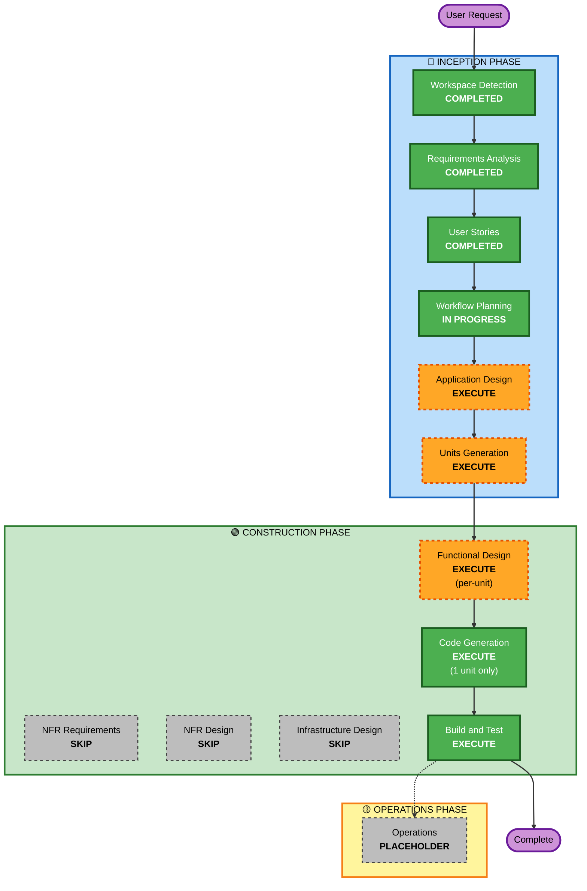

# Execution Plan — WaitLess

**プロジェクト**: WaitLess (Chrome 拡張機能, Manifest V3)
**フェーズ**: INCEPTION - Workflow Planning
**作成日**: 2026-05-26
**ステータス**: 承認待ち

---

## 1. 詳細分析サマリ

### 1.1 プロジェクト分類
- **タイプ**: Greenfield (既存コードなし)
- **既存「たびたび」サイクル資産**: `aidlc-docs-tabitabi-archive/` に退避済 (本サイクルとは無関係)

### 1.2 変更影響評価 (Change Impact Assessment)

| 項目 | 該当 | 内容 |
|------|------|------|
| ユーザー向け変更 | Yes | Chrome 拡張機能本体 (バックグラウンド/Content Script) + オプションページUI |
| 構造変更 | Yes (新規) | Manifest V3 のサービスワーカー + コンテンツスクリプト + オプションページ の3層構成 |
| データモデル変更 | Yes (新規) | `chrome.storage.local` に格納する設定スキーマを定義する必要あり |
| API変更 | No | 外部API呼び出しなし、ブラウザ標準 API のみ使用 |
| NFR インパクト | Yes | Manifest V3 制約、性能 (DOM監視オーバーヘッド)、Web Store 申請品質 |

### 1.3 リスク評価

| 項目 | レベル | 理由 |
|------|--------|------|
| リスクレベル | **Low〜Medium** | 単一の Chrome 拡張機能、外部連携なし、ローカル完結。ただし Claude.ai の DOM シグナル特定にやや不確実性あり |
| ロールバック複雑度 | Easy | 拡張機能を無効化/アンインストールするだけで完了 |
| テスト複雑度 | Moderate | 自動テストは制限あり、E2E は Chrome へ Unpacked ロードして手動確認が中心 |

### 1.4 主要技術制約 (要件 §6, §10 より)
- Manifest V3 準拠 (Service Worker ベース)
- 素の JavaScript / HTML / CSS、ビルドツール不使用
- npm 依存ゼロ前提
- `chrome.storage.local` のみ使用、外部送信なし
- 日本語UIのみ

---

## 2. ワークフロー可視化



### テキスト代替版

```
[INCEPTION PHASE]
  ✅ Workspace Detection ......... COMPLETED
  ✅ Requirements Analysis ....... COMPLETED
  ✅ User Stories ................ COMPLETED
  ⚙ Workflow Planning ........... IN PROGRESS
  ▶ Application Design .......... EXECUTE
  ▶ Units Generation ............ EXECUTE

[CONSTRUCTION PHASE]
  ▶ Functional Design ........... EXECUTE (per unit)
  ✕ NFR Requirements ............ SKIP
  ✕ NFR Design .................. SKIP
  ✕ Infrastructure Design ....... SKIP
  ▶ Code Generation ............. EXECUTE (1 unit only, ユニット選定は Units Generation 後に協議)
  ▶ Build and Test .............. EXECUTE

[OPERATIONS PHASE]
  - Operations .................. PLACEHOLDER
```

---

## 3. ステージ実行/スキップ判断

### 🔵 INCEPTION PHASE

| ステージ | 判断 | Rationale |
|---------|------|-----------|
| Workspace Detection | ✅ COMPLETED | Greenfield 判定済 |
| Requirements Analysis | ✅ COMPLETED | requirements.md 承認済 |
| User Stories | ✅ COMPLETED | personas.md, stories.md 承認済 |
| Workflow Planning | ⚙ IN PROGRESS | 本ドキュメント |
| **Application Design** | ▶ **EXECUTE** | 新規構成 (Service Worker / Content Script / Options Page) のコンポーネント分割と責務定義が必要。コンポーネント間メッセージング設計も必要 |
| **Units Generation** | ▶ **EXECUTE** | Q10 (Inception 完了 + Construction で 1ユニット) の方針に基づき、複数ユニットへの分解を行いどれを実装するか選定する必要あり |

### 🟢 CONSTRUCTION PHASE

| ステージ | 判断 | Rationale |
|---------|------|-----------|
| **Functional Design** (per-unit) | ▶ **EXECUTE** | DOM 監視シグナル特定、しきい値判定ロジック、タブ探索/切替アルゴリズム、設定スキーマ など、業務ロジックの詳細設計が必要 |
| NFR Requirements (per-unit) | ✕ **SKIP** | 拡張ルール (Security/PBT) 共に不適用 (Q12=B, Q13=C)。性能/セキュリティ要件は Application Design / Functional Design の範囲で対応可能。MVP 規模であり改めて NFR 整理する必要は低い |
| NFR Design (per-unit) | ✕ **SKIP** | NFR Requirements がスキップのため自動的にスキップ |
| Infrastructure Design (per-unit) | ✕ **SKIP** | サーバー / クラウドインフラなし。Chrome 拡張のみで完結 |
| **Code Generation** (per-unit) | ▶ **EXECUTE** | 常に実行。本サイクルでは Q10 に基づき **1ユニット分** のみ実施 (ユニット選定は Units Generation 後に協議) |
| **Build and Test** | ▶ **EXECUTE** | 常に実行。Chrome に Unpacked ロードして主要動線が動くことの検証手順を整備 |

### 🟡 OPERATIONS PHASE

| ステージ | 判断 |
|---------|------|
| Operations | PLACEHOLDER (将来) |

---

## 4. パッケージ更新シーケンス

Greenfield のため該当なし。

---

## 5. 推定タイムライン

ハッカソン文脈の作業時間ベース (1人作業の純粋見積、休憩等含まず):

| ステージ | 見積 |
|---------|------|
| Application Design | 0.5〜1時間 |
| Units Generation | 0.5時間 |
| Functional Design (1 ユニット) | 0.5〜1時間 |
| Code Generation (1 ユニット) | 1〜2時間 |
| Build and Test | 0.5〜1時間 |
| **合計** | **約3〜5.5時間** |

(対話・承認のラウンドトリップを含めるとカレンダー時間はさらに延びます)

---

## 6. 成功基準 (Success Criteria)

### 6.1 主要ゴール
WaitLess 拡張機能が、Claude.ai での待ち発生 → 娯楽タブ自動切替 → 完了検知 → AIタブ自動戻り のループを Chrome (Unpacked) で動作させられる状態。

### 6.2 主要成果物
- `manifest.json`, `service_worker.js`, Claude.ai 用 Content Script, オプションページ (HTML/CSS/JS), アイコン等の最低限の構成
- Application Design / Units Generation / Functional Design (本サイクルで実装する 1 ユニット分) のドキュメント
- Build and Test 実施手順 (Unpacked ロード、主要動線の手動検証手順)

### 6.3 品質ゲート
- [ ] manifest.json のバリデーションエラーがない
- [ ] Chrome に Unpacked ロードできる
- [ ] 中核体験フロー (要件 §4) のうち、本サイクルで対象とした 1 ユニット分の動線が手動で動く
- [ ] 設定の永続化が `chrome.storage.local` で機能している (該当ユニットの場合)
- [ ] 外部送信が発生していないことを Network タブで確認可能

---

## 7. 拡張ルール適用状況 (Extension Configuration)

| Extension | Enabled | Decided At |
|-----------|---------|------------|
| Security Baseline | No | Requirements Analysis |
| Property-Based Testing | No | Requirements Analysis |

---

## 8. 既知の不確実性

- **Claude.ai の DOM シグナル**: 現行UIのストリーミング状態を表す DOM 要素 (停止ボタン、ストリーミングインジケータ 等) の特定は Application Design / Functional Design で実機確認しながら詰める。Claude.ai のUI変更でシグナルが変わるリスクは MVP 段階では「壊れたら直す」運用で許容
- **オートプレイポリシー**: ブラウザの自動再生制御により、登録した動画URLが切替時に自動再生されないケースがある (要件 §10.3 既知リスク)。失敗時は静かに無視する設計とする
- **複数ウィンドウ**: 複数ウィンドウまたぎのタブ探索ポリシー (現在ウィンドウ限定 vs 全ウィンドウ) は Functional Design で確定
- **本サイクルで実装する 1 ユニットの選定**: Units Generation でユニット分割が出揃った時点で改めて協議 (CQ9=C)
