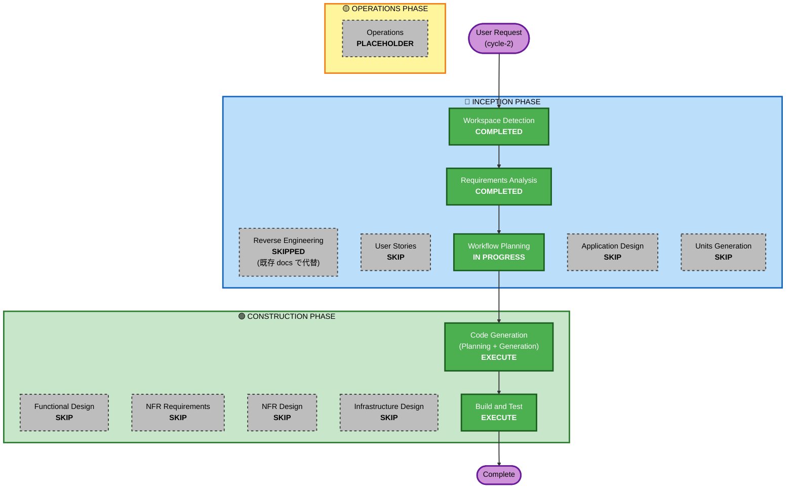

# Execution Plan — WaitLess cycle-2

最終更新: 2026-05-27

---

## Detailed Analysis Summary

### Transformation Scope (Brownfield)
- **Transformation Type**: Single component change (Chrome 拡張機能の小規模 UX/メッセージング更新)
- **Primary Changes**:
  - Options Page の空状態案内テキストの拡張 (FR-22)
  - `manifest.json` の `action.default_title` 文言更新 (FR-25)
  - `extension/README.md` の対応サイト一覧追加 (FR-23)
  - 動画以外サイトでの誤動作なし (実機検証) (FR-24)
- **Related Components**: `extension/options/`, `extension/manifest.json`, `extension/README.md` のみ
- **Cross-Package Impact**: なし (cycle-2 は単一拡張機能内の変更のみ)

### Change Impact Assessment
- **User-facing changes**: Yes — 空状態案内の文言、`default_title`、README 表現が変更される
- **Structural changes**: **No** — 既存コンポーネント・サービス境界は変えない
- **Data model changes**: **No** — `{domain, url, priority}` を維持 (NFR-07 後方互換性)
- **API changes**: **No** — メッセージタイプ・関数シグネチャに変更なし
- **NFR impact**: 軽微 — NFR-07 (後方互換性) のみ追加、既存 NFR は全て維持

### Component Relationships (Brownfield)
変更が及ぶコンポーネント (cycle-1 と同じ構成のうち):

| コンポーネント | 変更タイプ | 変更理由 | 優先度 |
|---------------|-----------|---------|-------|
| OptionsApp (`options/options.js`, `options/options.html`) | Minor (文言/サンプル URL) | FR-22 空状態案内拡張 | Important |
| Manifest (`manifest.json`) | Configuration-only (`action.default_title`) | FR-25 汎用文言化 | Important |
| README (`extension/README.md`) | Documentation | FR-23 対応サイト一覧 | Important |
| (実機検証対象) ClaudeSiteAdapter / TabManager / PlaybackTrigger / PlaybackPause | **変更なし** | FR-24 検証のみ。**コード変更しない** | (検証のみ) |

変更が **及ばない** コンポーネント (cycle-1 のまま):
- MessageRouter, WaitOrchestrator, TabManager, SettingsRepository, RuntimeState
- ClaudeSiteAdapter, PlaybackTrigger, PlaybackPause

### Risk Assessment
- **Risk Level**: **Low**
- **Rollback Complexity**: **Easy** (テキスト/設定変更のみ、ロジック変更なし)
- **Testing Complexity**: **Simple** (既存の手動 E2E に新サイト 3〜4 種を追加するのみ)
- **理由**:
  - データモデル / コアロジックを意図的に変えない (アンチスコープで明文化)
  - 後方互換性 NFR-07 が満たされる (マイグレーション処理不要)
  - 影響範囲が UI 文言と検証中心
  - cycle-1 で既に動作実績のあるコードを継承

---

## Workflow Visualization



### テキスト代替 (Mermaid 不可な場合)

```
[INCEPTION PHASE]
  Workspace Detection ........... [COMPLETED]
  Reverse Engineering ........... [SKIPPED] (既存 docs/architecture.md, cycle-1 archive で代替)
  Requirements Analysis ......... [COMPLETED]
  User Stories .................. [SKIP]
  Workflow Planning ............. [IN PROGRESS]
  Application Design ............ [SKIP]
  Units Generation .............. [SKIP]

[CONSTRUCTION PHASE]
  Functional Design ............. [SKIP]
  NFR Requirements .............. [SKIP]
  NFR Design .................... [SKIP]
  Infrastructure Design ......... [SKIP]
  Code Generation ............... [EXECUTE] (Planning + Generation)
  Build and Test ................ [EXECUTE]

[OPERATIONS PHASE]
  Operations .................... [PLACEHOLDER]
```

---

## Phases to Execute / Skip

### 🔵 INCEPTION PHASE

- [x] **Workspace Detection** — COMPLETED
- [x] **Reverse Engineering** — SKIPPED
  - **Rationale**: cycle-1 archive (`aidlc-docs-waitless-archive/cycle-1/`) と `docs/architecture.md` で現状理解は十分整備済み
- [x] **Requirements Analysis** — COMPLETED
  - **Rationale**: ユーザー承認済み (`aidlc-docs/inception/requirements/requirements.md`)
- [ ] **User Stories** — SKIP
  - **Rationale**:
    - 新ペルソナなし (Q8=A、タカシのレンジ拡張のみ)
    - 要件文書 §5 で代表ユーザーシナリオ (S-1〜S-3) を既に記載済み
    - cycle-1 archive に US-01〜06 が整備済み、cycle-2 で根本的に変わるストーリーはない (FR-21 はインプリシットに US-04「YouTube 以外も登録できる」の延長線上)
    - スコープがシンプル (UI 文言・README・default_title が中心)
- [x] **Workflow Planning** — IN PROGRESS
- [ ] **Application Design** — SKIP
  - **Rationale**:
    - 新コンポーネント・新サービス層なし
    - 既存 9 コンポーネント (cycle-1 で確定) の責務境界・メソッドシグネチャに変更なし
    - 変更は OptionsApp の表示テキスト、Manifest の文言、README のみ
- [ ] **Units Generation** — SKIP
  - **Rationale**:
    - cycle-1 で 1 ユニット (`waitless-extension`) 確定済み
    - cycle-2 で複数ユニットへの分解の必要性なし、既存ユニット内での修正のみ

### 🟢 CONSTRUCTION PHASE

- [ ] **Functional Design** — SKIP
  - **Rationale**:
    - 新ビジネスロジックなし、新規ビジネスルール (BR) なし
    - cycle-1 で確定した BR-01〜22 を維持
    - 新規データエンティティなし
- [ ] **NFR Requirements** — SKIP
  - **Rationale**:
    - 既存 NFR (NFR-01〜06) を維持
    - 新規 NFR-07 (後方互換性) のみ要件文書 §4 に簡易記載済み (専用 NFR Requirements ステージ不要)
    - 技術スタック確定済み (Chrome MV3 / Vanilla JS)
- [ ] **NFR Design** — SKIP
  - **Rationale**: NFR Requirements が SKIP と整合、新規 NFR パターン導入なし
- [ ] **Infrastructure Design** — SKIP
  - **Rationale**:
    - Chrome 拡張機能のためインフラなし (cycle-1 と同じ)
    - クラウドリソースなし
- [ ] **Code Generation** — EXECUTE (ALWAYS)
  - **Rationale**: 各 FR に対応した実装変更が必要 (Options 空状態テキスト、Manifest 文言、README)
  - **Part 1**: Code Generation Plan を作成
  - **Part 2**: Plan に基づきコード生成
- [ ] **Build and Test** — EXECUTE (ALWAYS)
  - **Rationale**:
    - 既存 Unpacked ロード手順を継続
    - FR-24 (動画以外サイトでの誤動作なし) を実機検証する手順を追加
    - cycle-1 の integration-test-instructions に新ユースケースを追記

### 🟡 OPERATIONS PHASE

- [ ] **Operations** — PLACEHOLDER
  - **Rationale**: 将来拡張用 (deployment / monitoring 等)、現時点では何もしない

---

## 実行ステージ数

| 区分 | 数 |
|------|---|
| Execute | **3 ステージ** (Workflow Planning, Code Generation, Build and Test) |
| Skip (Inception) | 4 ステージ (User Stories / Application Design / Units Generation, Reverse Engineering 含む) |
| Skip (Construction) | 4 ステージ (Functional Design / NFR Requirements / NFR Design / Infrastructure Design) |

**合計実行ステージ数 = 3** (Workflow Planning 含む)、cycle-1 比で大幅に圧縮 (シンプルな改修のため)。

---

## Estimated Timeline (目安)

| ステージ | 推定時間 |
|---------|---------|
| Code Generation - Planning | 短時間 (チェックリスト作成のみ) |
| Code Generation - Generation | 短時間 (3〜4 ファイル変更) |
| Build and Test | 短時間 (Unpacked ロード + 数シナリオ手動検証) |

実装規模は **コード変更 3〜4 ファイル + ドキュメント更新 1 ファイル** と見積。

---

## Success Criteria

### Primary Goal
ユーザーが Options Page から動画以外の遷移先 (ゲーム / EC / SNS / ストレッチ瞑想) を登録でき、待ち時間に自動で切替えられる。コード変更によるリグレッションがない。

### Key Deliverables

1. `extension/options/options.html`, `options/options.js` — 空状態案内に 5 種以上の用途例とサンプル URL (FR-22)
2. `extension/manifest.json` — `action.default_title` を汎用文言に更新 (FR-25)
3. `extension/README.md` — 対応する遷移先パターン一覧を追加 (FR-23)
4. `aidlc-docs/construction/build-and-test/` — cycle-2 用の検証手順 (FR-24 新ユースケース追加分)
5. `aidlc-docs/construction/waitless-extension/code/code-generation-summary.md` — cycle-2 のコード変更サマリ

### Quality Gates

- [ ] cycle-1 で動作確認済の主要シナリオ (Claude.ai 待ち発生 → 切替 → 完了 → 復帰) が引き続き動作 (NFR-07)
- [ ] cycle-1 で登録済のデータ (`chrome.storage.local`) がマイグレーションなしで読める (NFR-07)
- [ ] 動画以外のサイト (例: Amazon, X.com, Web ゲーム, 瞑想 Web アプリ) で切替時にコンソールエラーなし (FR-24)
- [ ] Options Page の空状態案内に 5 種以上の用途例が表示 (FR-22)
- [ ] `default_title` が「YouTube」を含まない汎用文言 (FR-25)
- [ ] README に対応する遷移先パターンセクションがある (FR-23)

### Integration Testing Strategy
- 既存の cycle-1 13 シナリオ手動 E2E は **そのまま実施** (リグレッション確認)
- cycle-2 用に **新シナリオ 3〜4 件追加**:
  - 「ゲームサイトを登録 → 待ち発生で切替 → 動画ナシでも例外なし」
  - 「EC サイト (Amazon) を登録 → 切替 → 完了で復帰」
  - 「外部瞑想 Web アプリを登録 → 切替 → 完了で復帰」
  - (オプション) 「cycle-1 で登録済データ + cycle-2 拡張機能リロード → そのまま動作」(後方互換性 NFR-07)

---

## Package Change Sequence (Brownfield)

cycle-2 では単一の拡張機能ユニット (`extension/`) のみを修正。複数モジュール調整は不要。

更新対象ファイル (依存順):

1. `extension/manifest.json` (`default_title` のみ、独立)
2. `extension/options/options.html` (空状態案内マークアップ)
3. `extension/options/options.js` (空状態案内のレンダリングロジック、必要なら)
4. `extension/options/options.css` (新マークアップのスタイル、必要なら)
5. `extension/README.md` (対応サイト一覧)

これらは互いに独立しており、順不同で更新可能。

---

## 関連ドキュメント

- 要件: `aidlc-docs/inception/requirements/requirements.md`
- 現状アーキテクチャ: `docs/architecture.md`
- バックログ: `docs/backlog.md`
- cycle-1 archive: `aidlc-docs-waitless-archive/cycle-1/`
