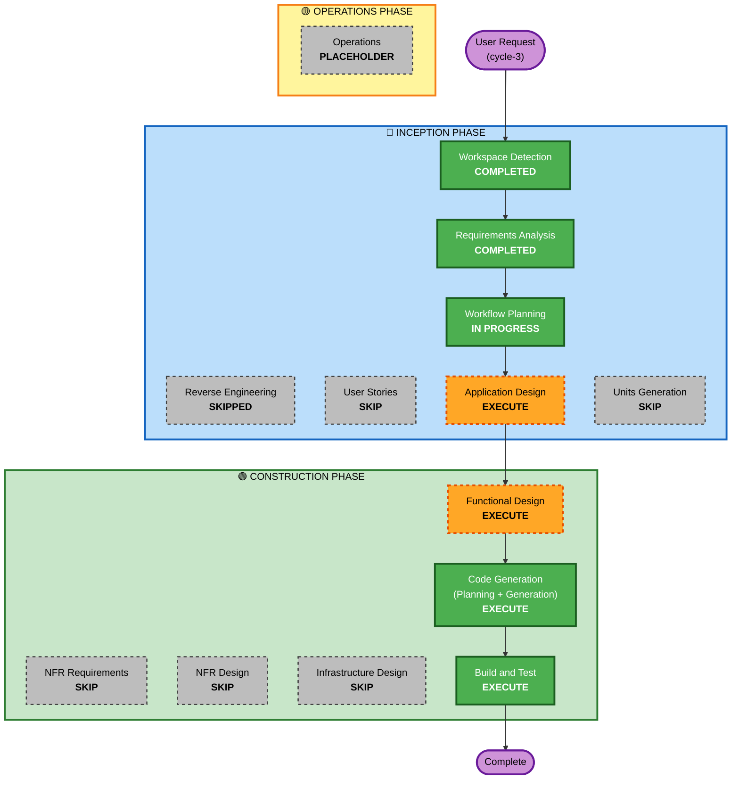

# Execution Plan — WaitLess cycle-3

最終更新: 2026-05-27

---

## Detailed Analysis Summary

### Transformation Scope (Brownfield)
- **Transformation Type**: 新コンポーネント追加 (拡張機能内蔵の読書ページ Reader Page、新規データ永続化キー追加)
- **Primary Changes**:
  - 新規ディレクトリ `extension/reader/` (HTML / CSS / JS + 組み込み小説テキスト)
  - 新規データ永続化キー `chrome.storage.local` の `reader_state` (既存 `sites` / `threshold_sec` とは独立)
  - `manifest.json` に `web_accessible_resources` を追加 (`reader.html` を URL アクセス可能化)
  - Options Page の空状態案内に動的 URL (`chrome.runtime.getURL(...)`) のサンプルを追加 (FR-37)
  - `extension/README.md` に読書ページ機能の紹介を追加
- **Related Components**: `extension/reader/`, `extension/manifest.json`, `extension/options/{html,js}`, `extension/README.md`
- **Cross-Package Impact**: なし (cycle-1〜3 通じて単一拡張機能ユニット)

### Change Impact Assessment
- **User-facing changes**: **Yes** (新ページ、新 UI 体験、空状態案内の文言追加)
- **Structural changes**: **Yes (新コンポーネント追加)** — 新コンポーネント Reader Page (UI 層 + 永続化アクセス) を導入。ただし既存 9 コンポーネントには変更なし
- **Data model changes**: **Yes (新キーのみ追加、既存スキーマは無変更)** — `chrome.storage.local` に `reader_state` を新規追加。`sites` / `threshold_sec` は無変更 (NFR-07 後方互換性)
- **API changes**: **No** (既存メッセージタイプは無変更、Reader Page 内部は SW と通信せず直接 `chrome.storage.local` を読み書き)
- **NFR impact**: 軽微〜中 (NFR-08 復元パフォーマンス、NFR-10 可読性が新規)

### Component Relationships (Brownfield)

新規コンポーネント:

| コンポーネント | レイヤー | ファイル | 責務 |
|---------------|---------|---------|------|
| **ReaderPage** (新規) | Layer 4: UI / Page | `extension/reader/reader.{html,css,js}` | 読書ページ UI、組み込み小説の表示、クリック/スクロールハンドラ、既読位置の表示 |
| **ReaderStateRepository** (新規、論理的) | Layer 1: Domain Service | `reader.js` 内に内蔵 | `chrome.storage.local` の `reader_state` キーへの CRUD |
| **NovelContent** (新規、データ) | データアセット | `extension/reader/novel.{txt|json}` | 組み込み小説テキスト + メタデータ |

cycle-1〜2 から継承するコンポーネント:

| コンポーネント | 変更タイプ | 変更理由 |
|---------------|-----------|---------|
| Manifest | Configuration-only (`web_accessible_resources` 追加) | Reader Page を URL でロードするため |
| OptionsApp + OptionsAPI | Minor (空状態案内に動的 URL を追加) | FR-37 のため |
| README | Documentation | FR-31 紹介のため |
| その他 (sw/*, content/*, service_worker.js) | **変更なし** | 既存 2 パス探索で `chrome-extension://` URL も扱える想定 (Application Design で確認) |

### Risk Assessment
- **Risk Level**: **Medium**
- **Rollback Complexity**: **Easy〜Moderate** (新規ファイル削除 + 軽微な修正のリバートで戻せるが、ユーザーが既に `chrome-extension://...` を Site 登録していた場合は手動削除が必要)
- **Testing Complexity**: **Moderate** (新ページの UI ロジック、永続化、起動時復元、既存切替フローとの統合検証)
- **理由**:
  - 新規コンポーネント追加 + 新規データキーがあり、cycle-2 比で実装規模 1 段階大きい
  - 既存 2 パス探索ロジック (`extractDomain`) が `chrome-extension://` URL でどう動くかが要確認 (Application Design で検証)
  - 既存ロジックは原則無変更だが、最小修正の可能性は否定できない (`extractDomain` のホスト抽出仕様次第)
  - クリックインタラクションの実装難度自体は中程度 (DOM 分割アプローチで O(N) 回避可能)

---

## Workflow Visualization



### テキスト代替

```
[INCEPTION PHASE]
  Workspace Detection ........... [COMPLETED]
  Reverse Engineering ........... [SKIPPED] (既存 docs / archive で代替)
  Requirements Analysis ......... [COMPLETED]
  User Stories .................. [SKIP]
  Workflow Planning ............. [IN PROGRESS]
  Application Design ............ [EXECUTE] (新コンポーネント Reader Page の責務定義)
  Units Generation .............. [SKIP] (引き続き 1 ユニット内)

[CONSTRUCTION PHASE]
  Functional Design ............. [EXECUTE] (クリック判定アルゴリズム + 起動時復元シーケンス + BR 詳細)
  NFR Requirements .............. [SKIP]
  NFR Design .................... [SKIP]
  Infrastructure Design ......... [SKIP]
  Code Generation ............... [EXECUTE]
  Build and Test ................ [EXECUTE]

[OPERATIONS PHASE]
  Operations .................... [PLACEHOLDER]
```

---

## Phases to Execute / Skip

### 🔵 INCEPTION PHASE

- [x] **Workspace Detection** — COMPLETED
- [x] **Reverse Engineering** — SKIPPED
  - **Rationale**: cycle-1 / cycle-2 archive と `docs/architecture.md` で現状理解は十分整備済み
- [x] **Requirements Analysis** — COMPLETED
  - **Rationale**: ユーザー承認済み (`aidlc-docs/inception/requirements/requirements.md`)
- [ ] **User Stories** — SKIP
  - **Rationale**:
    - 既存ペルソナ (タカシ) の延長線、新ペルソナなし
    - 要件文書 §5 で代表シナリオ S-1〜S-4 を記載済み
    - 単一機能でユーザーフロー分岐が少ない
- [x] **Workflow Planning** — IN PROGRESS
- [ ] **Application Design** — **EXECUTE**
  - **Rationale**:
    - **新コンポーネント** ReaderPage と論理的な ReaderStateRepository を導入
    - 既存 9 コンポーネントとの境界 (どこまで共有するか、何を独立させるか) の整理が必要
    - 既存 `extractDomain` と `chrome-extension://` URL の互換性確認が要 (`chrome-extension://[ID]/...` がどう抽出されるか)
    - cycle-2 では SKIP したが cycle-3 は新コンポーネントがあるため EXECUTE
- [ ] **Units Generation** — SKIP
  - **Rationale**:
    - cycle-1 で確定した 1 ユニット (`waitless-extension`) 内での追加
    - 複数ユニットへの分解は不要 (Reader Page も同じ拡張機能内、ビルド単位は同一)

### 🟢 CONSTRUCTION PHASE

- [ ] **Functional Design** — **EXECUTE**
  - **Rationale**:
    - **クリック判定アルゴリズム** (DOM 上のクリック座標 → 文字オフセット変換) と **既読範囲の DOM 表現** (split into 2 spans) の設計が必要
    - **起動時復元シーケンス** (state 読み込み → 青色化 → スクロール) の順序定義が必要
    - **保存タイミング** (即時 / 離脱検知) の整理が必要
    - **新規 BR-31〜36** をビジネスルール文書として明文化
- [ ] **NFR Requirements** — SKIP
  - **Rationale**:
    - 既存 NFR-01〜07 を維持、新規 NFR-08〜10 は要件文書 §4 で簡易記載済み
    - 技術スタック (Vanilla JS) 確定済み
- [ ] **NFR Design** — SKIP
  - **Rationale**: NFR Requirements が SKIP と整合
- [ ] **Infrastructure Design** — SKIP
  - **Rationale**: Chrome 拡張機能のためインフラなし
- [ ] **Code Generation** — EXECUTE (ALWAYS)
  - **Rationale**: 新規ファイル一式 + 修正の実装が必要
  - **Part 1**: Code Generation Plan を作成
  - **Part 2**: Plan に基づきコード生成
- [ ] **Build and Test** — EXECUTE (ALWAYS)
  - **Rationale**:
    - 既存 Unpacked ロード手順を継続
    - cycle-3 用に新シナリオ (Reader Page 起動 / クリック / 永続化 / 復元 / 双方向クリック / 既存リグレッション)
    - cycle-1/2 リグレッションシナリオ T-01〜T-20 も実施

### 🟡 OPERATIONS PHASE

- [ ] **Operations** — PLACEHOLDER

---

## 実行ステージ数

| 区分 | 数 |
|------|---|
| Execute | **5 ステージ** (Workflow Planning, Application Design, Functional Design, Code Generation, Build and Test) |
| Skip (Inception) | 3 ステージ (Reverse Engineering, User Stories, Units Generation) |
| Skip (Construction) | 3 ステージ (NFR Requirements / NFR Design / Infrastructure Design) |

**合計実行ステージ数 = 5** (Workflow Planning 含む)。cycle-2 (3 ステージ) より +2 (Application Design + Functional Design)。

---

## Estimated Timeline (目安)

| ステージ | 推定 |
|---------|------|
| Application Design | 短〜中 (新コンポーネント定義、`extractDomain` 互換性確認) |
| Functional Design | 中 (クリック判定アルゴリズム、起動時復元シーケンス、BR 明文化) |
| Code Generation - Planning | 短 |
| Code Generation - Generation | 中 (新規ファイル一式 + 既存最小修正) |
| Build and Test | 短〜中 (シナリオ拡張) |

実装規模:
- **新規ファイル**: 4〜5 (`reader.html` / `reader.css` / `reader.js` / `novel.txt or .json` / 必要なら `novel.js`)
- **修正ファイル**: 4 (`manifest.json` / `options.html` / `options.js` / `README.md`)
- **コード行数**: cycle-1 (3,000 行) の 1/3 程度の追加 (推定 800〜1,000 行)

---

## Success Criteria

### Primary Goal
ユーザーが Options Page から Reader Page (`chrome-extension://[ID]/reader/reader.html`) を 1 サイトとして登録でき、AI 待ち時間に読書ページが開き、組み込み小説を読み進められる。クリックで既読範囲を青色化、スクロール + クリック位置を `chrome.storage.local` に永続化、起動時に復元される。cycle-1/2 の動作にリグレッションがない。

### Key Deliverables

1. `extension/reader/reader.html` (FR-31)
2. `extension/reader/reader.css` (FR-32, NFR-10)
3. `extension/reader/reader.js` (FR-33〜36, BR-31〜36)
4. `extension/reader/novel.{txt|json}` (組み込み小説、青空文庫等のパブリックドメイン)
5. `extension/manifest.json` 修正 (`web_accessible_resources`)
6. `extension/options/options.{html,js}` 修正 (空状態案内に動的 URL を追加、FR-37)
7. `extension/README.md` 修正 (読書ページ紹介)
8. `aidlc-docs/inception/application-design/*` (新コンポーネント設計)
9. `aidlc-docs/construction/waitless-extension/functional-design/*` (アルゴリズム + BR)
10. `aidlc-docs/construction/waitless-extension/code/code-generation-summary.md`
11. `aidlc-docs/construction/build-and-test/*` (cycle-3 用検証手順)

### Quality Gates

- [ ] 既存の 2 パス探索が `chrome-extension://` URL でも動作 (Application Design で確認)
- [ ] Reader Page で組み込み小説が表示される (FR-31)
- [ ] クリックで青色化 (双方向、FR-33)
- [ ] クリック位置 + スクロール位置の永続化 (FR-34, FR-35)
- [ ] 起動時に状態復元 (FR-36)
- [ ] cycle-1/2 のリグレッションシナリオ T-01〜T-20 がパス (NFR-07)
- [ ] PlaybackTrigger は `<video>` がない Reader Page で誤動作なし

### Integration Testing Strategy
- 既存 cycle-1/2 シナリオ T-01〜T-20 を実施 (リグレッション)
- cycle-3 用に新シナリオ T-21〜T-28 程度を追加 (Reader Page 起動、クリック、永続化、復元、双方向、既存切替フローとの統合)

---

## Package Change Sequence (Brownfield)

cycle-3 では単一拡張機能ユニット (`extension/`) のみを修正。複数モジュール調整は不要。

更新対象ファイル (依存順):

1. `extension/reader/novel.{txt|json}` (組み込み小説、独立)
2. `extension/reader/reader.html`, `reader.css`, `reader.js` (新規一式)
3. `extension/manifest.json` (`web_accessible_resources` 追加)
4. `extension/options/options.html`, `options.js` (空状態案内に動的 URL)
5. `extension/README.md` (Reader 機能紹介)

---

## 関連ドキュメント

- 要件: `aidlc-docs/inception/requirements/requirements.md`
- 現状アーキテクチャ: `docs/architecture.md`
- バックログ: `docs/backlog.md`
- cycle-1 archive: `aidlc-docs-waitless-archive/cycle-1/`
- cycle-2 archive: `aidlc-docs-waitless-archive/cycle-2/`
