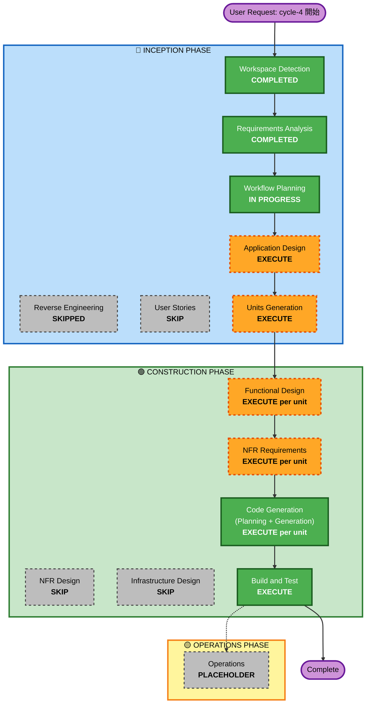

# cycle-4 — Execution Plan

最終更新: 2026-05-27

---

## 1. Detailed Analysis Summary

### 1.1 Transformation Scope (Brownfield)

- **Transformation Type**: Cross-system feature addition (新規 IDE 拡張 + 既存 Chrome 拡張への通信モジュール追加 + 新規 IPC レイヤー)
- **Primary Changes**:
  - **新規** `vscode-extension/` (TypeScript) — Kiro IDE 用の VS Code 拡張機能
  - **改修** `extension/` (既存 Chrome 拡張、cycle-3 完了状態 v0.3.0) に `sw/ide_bridge.js` を追加 + `service_worker.js` から import
  - **新規** ローカル WebSocket IPC レイヤー (両側に実装)
  - **新規** Agent Hooks テンプレート (`.kiro/hooks/*.json`)
- **Related Components** (既存):
  - `extension/service_worker.js` — `sw/ide_bridge.js` の import 行のみ追加
  - `extension/manifest.json` — `permissions` に必要なら `webSocket` 等の Manifest V3 互換のみ追加 (現状 v3 で `<all_urls>` 持ちのため変更最小限の見込み)
  - `docs/architecture.md` — cycle-4 のアーキテクチャ追加でメンテナンス更新
  - `docs/backlog.md` — Antigravity 風実装に伴う既存 backlog 項目の更新

### 1.2 Change Impact Assessment

| 影響領域 | 該否 | 内容 |
|---|---|---|
| **User-facing changes** | Yes | Kiro 内に新しい体験 (Hook 起動 / 自動切替 / 戻り)。Chrome 拡張ユーザーには直接の UI 変更はないが、Options Page に IPC ON/OFF トグル追加 (FR-61) |
| **Structural changes** | Yes | 新規拡張機能 + 新規 IPC レイヤーの追加。既存 Chrome 拡張のコア (WaitOrchestrator/TabManager) は無変更だが、新規 `ide_bridge.js` がコールバックでこれらを呼ぶ |
| **Data model changes** | Minor | 既存 `chrome.storage.local.sites` のスキーマは無変更。VS Code 拡張側に `aiWaitLessMode.urls: string[]` 設定を新規追加 |
| **API changes** | Yes | 新規 WebSocket メッセージプロトコル (FR-52 で 7 タイプ定義)。これは新規 contract |
| **NFR impact** | Yes | NFR-21〜29 (TypeScript / 配布 / テスト方針 / OS 依存 / IPC セキュリティ / 後方互換性 / フォールバック / シェルインジェクション対策) |

### 1.3 Component Relationships (Brownfield)

```
Primary: vscode-extension/  (新規、Kiro 環境で動作)
   |
   |  WebSocket (ws://127.0.0.1:39472)
   v
Secondary: extension/sw/ide_bridge.js  (新規、Chrome 拡張内)
   |
   |  既存コールバック呼び出し
   v
Existing (無変更): WaitOrchestrator, TabManager, SettingsRepository, RuntimeState

Supporting:
- extension/service_worker.js  (1 行追加で ide_bridge を import)
- extension/options/options.{html,js}  (FR-61 で IPC ON/OFF トグル追加)
- .kiro/hooks/  (cycle-4 で新規ディレクトリ、テンプレートファイル配置)
- docs/architecture.md  (メンテナンス更新)
- docs/backlog.md  (項目移動)
```

各 related component:
- **vscode-extension/** : Major (新規)
- **extension/sw/ide_bridge.js** : Major (新規モジュール)
- **extension/service_worker.js** : Minor (1 行 import 追加)
- **extension/manifest.json** : Configuration-only (host_permissions 検証、必要なら追加)
- **extension/options/options.{html,js}** : Minor (IPC トグル追加)
- **.kiro/hooks/** テンプレート : Major (新規)

### 1.4 Risk Assessment

- **Risk Level**: **Medium**
- **理由**:
  - Kiro Agent Hooks の挙動が想定通り発火するかの不確実性 (R-01)
  - `osascript` のアプリ名解決の不確実性 (R-02)
  - WebSocket のタイミング問題 (R-03, R-04)
  - macOS 限定 / Apple Events 許可 (R-05)
  - **緩和**: フォールバック (`vscode.env.openExternal`) を二重で持つ、Hook が動かなくても Command Palette からの手動実行を併設
- **Rollback Complexity**: **Easy** — 既存 Chrome 拡張のコア部分は無変更、`ide_bridge.js` を import しないだけで cycle-3 状態に戻せる。VS Code 拡張は単独物
- **Testing Complexity**: **Moderate** — 手動 E2E のみ (NFR-23) だが、IPC が絡むため 2 プロセスを同時起動して検証する必要あり

---

## 2. Workflow Visualization



### Text Alternative (Mermaid 失敗時用)

```
INCEPTION PHASE:
  Workspace Detection (COMPLETED)
  Reverse Engineering (SKIPPED — 別プラットフォームの新規開発、既存は docs/architecture.md でカバー済)
  Requirements Analysis (COMPLETED — Pattern γ 確定)
  User Stories (SKIP — 既存ペルソナ継承、新規ジャーニーなし)
  Workflow Planning (IN PROGRESS)
  Application Design (EXECUTE — 新規コンポーネント多数)
  Units Generation (EXECUTE — 3 unit に分割)

CONSTRUCTION PHASE (per unit):
  Functional Design (EXECUTE — 各 unit のビジネスロジック設計)
  NFR Requirements (EXECUTE — IPC セキュリティ / フォールバック / 後方互換性 等)
  NFR Design (SKIP — 同 NFR は Functional Design に inline で含める方針)
  Infrastructure Design (SKIP — クラウドリソースなし、ローカル動作のみ)
  Code Generation (EXECUTE per unit)
  Build and Test (EXECUTE — 全 unit 完了後の手動 E2E)

OPERATIONS PHASE: PLACEHOLDER
```

---

## 3. Phases to Execute

### 🔵 INCEPTION PHASE

- [x] **Workspace Detection** — COMPLETED
- [-] **Reverse Engineering** — SKIPPED
  - **Rationale**: 既存 `extension/` は cycle-1〜3 の archive と `docs/architecture.md` で十分にドキュメント化されている。cycle-4 のスコープは別プラットフォーム (VS Code 拡張) の新規開発が中心であり、既存コードは 1 つのモジュール (`sw/ide_bridge.js`) を新規追加するだけのため、再リバースエンジニアリングは不要
- [x] **Requirements Analysis** — COMPLETED (Pattern γ 確定)
- [-] **User Stories** — SKIP
  - **Rationale**: 主たるユーザーペルソナは既存 WaitLess ユーザーと同一 (cycle-1 の `aidlc-docs-waitless-archive/cycle-1/inception/user-stories/personas.md` を継承)。新規ジャーニーは「Kiro でプロンプト送信 → ブラウザ開く / Hook 完了 → 戻る」の単一フローで、要件 §3 に既に詳細化済。User Stories で得られる追加情報がない
- [x] **Workflow Planning** — IN PROGRESS (本ドキュメント作成中)
- [ ] **Application Design** — EXECUTE
  - **Rationale**: cycle-4 で **新規 vscode-extension** に複数コンポーネント (Hook handler / IDE Bridge / Settings Reader / Browser Launcher / Window Activator / Status Manager 等) を作る必要があり、それらの責務分離・依存関係・メソッド設計を Application Design で確定すべき。既存 Chrome 拡張側にも `IdeBridgeClient` という新規コンポーネントが入るため、既存アーキテクチャ (`docs/architecture.md`) への delta も明示する
- [ ] **Units Generation** — EXECUTE
  - **Rationale**: cycle-4 は **3 つの unit** に明確に分かれる:
    1. `vscode-extension` (新規 unit、TypeScript)
    2. `chrome-extension-bridge` (既存 unit への改修、JavaScript の `sw/ide_bridge.js` 追加)
    3. `agent-hooks-templates` (新規 unit、`.kiro/hooks/*.json` テンプレート)
  - これらは **依存順** (vscode-extension が IPC プロトコルを定義 → chrome-extension-bridge が実装 → agent-hooks-templates は両者の動作後に整合検証) があるため、unit を分けて順序立てて construct する

### 🟢 CONSTRUCTION PHASE (per unit)

- [ ] **Functional Design** — EXECUTE per unit
  - **Rationale**:
    - Unit 1 (vscode-extension): TypeScript の class / interface / function 設計、Hook 受信フロー、状態遷移、IPC client 設計が複雑
    - Unit 2 (chrome-extension-bridge): WebSocket client + メッセージハンドラ + 既存 WaitOrchestrator/TabManager との結合点
    - Unit 3 (agent-hooks-templates): Hook JSON スキーマ + コマンドマッピング + ユーザー導入手順
  - **NFR は Functional Design 文書内に inline で含める方針** (NFR Design ステージはスキップ)
- [ ] **NFR Requirements** — EXECUTE per unit
  - **Rationale**: NFR-24 (IPC セキュリティ), NFR-27 (後方互換性), NFR-28 (フォールバック), NFR-29 (シェルインジェクション対策) は実装の前提条件として明示的に NFR ドキュメント化する。tech stack 選定 (TypeScript 5.x + tsc / Node.js / VS Code Extension API バージョン) もここで確定
- [-] **NFR Design** — SKIP
  - **Rationale**: cycle-1〜3 と同様、別 NFR Design 文書は作らず、Functional Design 内に NFR 対応を inline で含める方針 (cycle-1〜3 の archive で同様の判断)。新規パターンの設計が必要な NFR は IPC セキュリティ (localhost-only bind) のみで、Functional Design に含められる粒度
- [-] **Infrastructure Design** — SKIP
  - **Rationale**: cycle-4 は完全ローカル動作 (クラウドリソースなし、デプロイ先なし、IaC なし)。IPC レイヤーは `127.0.0.1` の WebSocket でインフラ的にも 0 構成
- [ ] **Code Generation** — EXECUTE per unit (ALWAYS)
  - **Rationale**: 全 unit で実装が必要
- [ ] **Build and Test** — EXECUTE (ALWAYS、全 unit 完了後)
  - **Rationale**: cycle-1〜3 と同様、手動 E2E 手順書を整備。ただし IPC が絡む 2 プロセス検証になるため、cycle-1〜3 より少し手順が複雑

### 🟡 OPERATIONS PHASE

- [ ] **Operations** — PLACEHOLDER

---

## 4. Module Update Strategy (Brownfield)

### 4.1 Update Approach: **Sequential** (依存順)

cycle-4 では並列開発は推奨しない。理由は IPC プロトコルの定義が両 unit のインタフェース contract になるため。

### 4.2 Critical Path

```
Unit 1 (vscode-extension)
   ↓ (IPC プロトコル定義の確定)
Unit 2 (chrome-extension-bridge)
   ↓ (両 unit が動作可能になった後)
Unit 3 (agent-hooks-templates)
```

### 4.3 Coordination Points

- **IPC プロトコル定義** (FR-52 の 7 メッセージタイプ): Unit 1 の Functional Design で確定
- **既存 Chrome 拡張の version 番号**: Unit 2 で `0.3.0` → `0.4.0` にバンプ
- **既存 `docs/architecture.md`**: Build & Test の最終ステップでメンテナンス更新

### 4.4 Testing Checkpoints

1. **Unit 1 単独** (IPC 相手不在でフォールバック動作の検証)
2. **Unit 2 単独** (既存 Chrome 拡張の cycle-1〜3 シナリオが引き続き動作する後方互換性検証)
3. **Unit 1 + Unit 2 統合** (IPC 経由のメッセージフロー、tab 探索、媒体一時停止)
4. **Unit 1 + Unit 2 + Unit 3 全統合** (Hook トリガーから Kiro 戻りまでの full E2E)

### 4.5 Rollback Strategy

- 各 unit は独立してロールバック可能
- Unit 2 (`sw/ide_bridge.js`) のロールバックは `service_worker.js` から import 行を削除するだけ
- Unit 1 (vscode-extension) は `code --uninstall-extension` または開発モードを停止するだけ
- Unit 3 (`.kiro/hooks/*.json`) はファイル削除のみ

---

## 5. Estimated Timeline

- **Total Phases (執行予定)**: 5 (Application Design, Units Generation, Functional Design × 3, NFR Requirements × 3, Code Generation × 3, Build & Test)
- **Estimated Duration**: 1 サイクル内で完了可能 (cycle-1+2+3 程度の規模)

---

## 6. Success Criteria

### 6.1 Primary Goal
Kiro IDE でユーザーがプロンプト送信 → 外部ブラウザで娯楽 URL が開く → AI 完了で Kiro に自動フォーカス、までを Agent Hooks 経由で動作させる。

### 6.2 Key Deliverables

- `vscode-extension/` 配下の TypeScript 拡張機能 (ビルド済 `out/` または `.vsix` または開発モード起動可能)
- `extension/sw/ide_bridge.js` を含む Chrome 拡張 v0.4.0
- `.kiro/hooks/*.json` テンプレート (リポジトリ内の `vscode-extension/templates/hooks/` に同梱)
- 手動 E2E 手順書 (Build & Test 段階)
- `docs/architecture.md` / `docs/backlog.md` のメンテナンス更新

### 6.3 Quality Gates

- 既存 Chrome 拡張の cycle-1〜3 シナリオ (T-01〜T-30) が後方互換性を保って動作する
- vscode-extension が Kiro / VS Code どちらでもインストール時にクラッシュしない (純正 VS Code では Hook 部分が動かないだけで silent)
- IPC 通信失敗時 (Chrome 拡張未起動) もフォールバックで `vscode.env.openExternal` で URL が開く
- macOS で `osascript` 経由の Kiro フロント引き上げが動作する

---

## 7. 関連ドキュメント

- 要件: `aidlc-docs/inception/requirements/requirements.md`
- 既存アーキテクチャ: `docs/architecture.md`
- ハンドオーバー: `docs/cycle-4-handover.md`
- 監査ログ: `aidlc-docs/audit.md`
