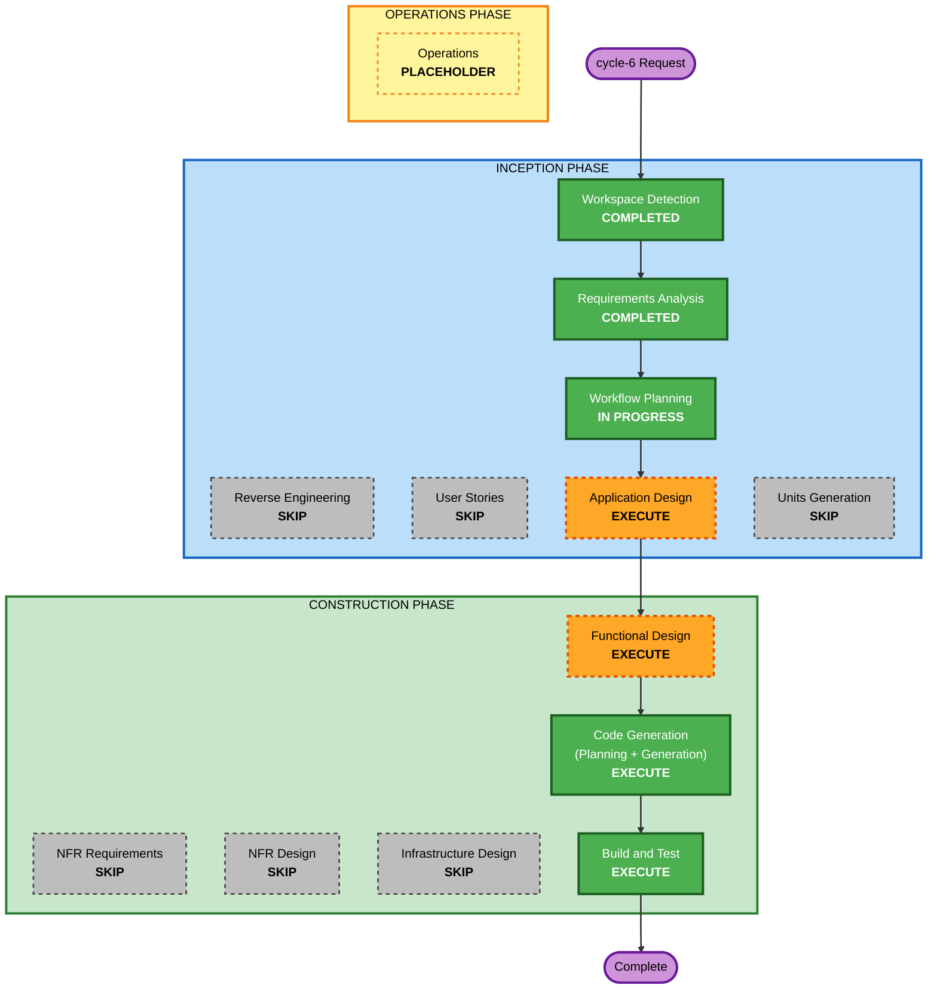

# cycle-6 Execution Plan — 統計ログ + ダッシュボード UI

最終更新: 2026-05-29

---

## 1. Detailed Analysis Summary

### 1.1 Transformation Scope (Brownfield)
- **Transformation Type**: Single-system feature addition (Chrome 拡張への新規機能 + VS Code 拡張からの統計連携)
- **Primary Changes**:
  - 新規 `extension/sw/stats_repository.js` (統計レコードの CRUD + 集計)
  - 新規 `extension/dashboard/` (ダッシュボードページ一式)
  - 既存イベント発火点 (`wait_orchestrator.js`) への統計記録呼び出し追加 (最小)
  - 余暇種別逆引きマップ (`portal_data.js` のジャンル情報を流用)
  - Claude.ai Content Script への「復帰後操作検知 + 再離脱検知」追加
  - VS Code 拡張からの IDE 待ちサイクル統計を IPC 経由で Chrome に送信
  - ポータル/Options からダッシュボードへの動線
- **Related Components**: message_router (新メッセージタイプ追加)、ide_bridge (IDE 統計の中継)

### 1.2 Change Impact Assessment
- **User-facing changes**: Yes — 新規ダッシュボード画面、ポータル/Options への動線
- **Structural changes**: No — 既存レイヤー構造は維持、新規モジュールを Layer 1 (Domain) と Layer 4 (Page) に追加
- **Data model changes**: Yes (追加のみ) — `chrome.storage.local` に新規キー `stats_events` を追加。既存 `sites` / `threshold_sec` / `reader_state` には干渉しない (後方互換)
- **API changes**: Yes (追加のみ) — 新規メッセージタイプ (`STATS_*`、`RESUME_ACTION`、`RE_LEFT` 等) を追加。既存タイプは無変更
- **NFR impact**: 既存 NFR 方針 (依存ゼロ/端末ローカル/ビルド不要) を踏襲。新規 NFR 要件なし

### 1.3 Component Relationships
- **Primary Component**: statsRepository (新規)、DashboardPage (新規)
- **Modified Components**:
  - WaitOrchestrator — 統計記録呼び出しを追加 (最小)
  - ClaudeSiteAdapter (content) — 復帰後操作検知 + visibilitychange 監視を追加
  - MessageRouter — 新メッセージタイプのルーティング追加
  - IdeBridge — IDE 統計の受信 → statsRepository への記録
  - VS Code 拡張 (extension.ts) — IDE 待ちサイクル統計の算出と IPC 送信
  - OptionsApp / PortalPage — ダッシュボードへの動線追加
- **Untouched (NFR-71 厳守)**: tab_manager.js (探索ロジック)、settings_repository.js、runtime_state.js、reader/*、playback_*.js のコアは無変更を目標

### 1.4 Risk Assessment
- **Risk Level**: Low〜Medium
- **Rollback Complexity**: Easy (新規ファイル追加が主体、既存への変更は追記中心)
- **Testing Complexity**: Moderate (集計ロジックの単体検証 + 実機 E2E)
- **主リスク**: (a) 既存コア体験を壊さないこと (NFR-71)、(b) Claude.ai Content Script への追加が待ち検知ロジックと干渉しないこと、(c) 統計レコードの肥大 (NFR-75)

---

## 2. Workflow Visualization



### Text Alternative (always included)
```
INCEPTION PHASE:
- Workspace Detection      : COMPLETED
- Reverse Engineering      : SKIP (docs/architecture.md が最新)
- Requirements Analysis    : COMPLETED
- User Stories             : SKIP (利用シナリオ AS-61〜65 で代替)
- Workflow Planning        : IN PROGRESS
- Application Design       : EXECUTE (新規コンポーネント責務定義)
- Units Generation         : SKIP (単一拡張内の追加、分解不要)

CONSTRUCTION PHASE:
- Functional Design        : EXECUTE (統計集計の business rules + データスキーマ)
- NFR Requirements         : SKIP (既存 NFR 方針踏襲、新規なし)
- NFR Design               : SKIP (同上)
- Infrastructure Design    : SKIP (インフラなし、端末ローカルのみ)
- Code Generation          : EXECUTE (ALWAYS)
- Build and Test           : EXECUTE (ALWAYS)

OPERATIONS PHASE:
- Operations               : PLACEHOLDER
```

---

## 3. Phases to Execute

### 🔵 INCEPTION PHASE
- [x] Workspace Detection (COMPLETED)
- [x] Reverse Engineering (SKIPPED — `docs/architecture.md` が cycle-5 完了状態の最新一次資料)
- [x] Requirements Analysis (COMPLETED — FR-71〜85, NFR-71〜77, M-01〜06)
- [x] User Stories (SKIPPED)
  - **Rationale**: 単一拡張への機能追加で、利用シナリオは要件の AS-61〜65 で明示済み。新規ペルソナは発生しない
- [x] Execution Plan (IN PROGRESS)
- [ ] Application Design - **EXECUTE**
  - **Rationale**: 新規コンポーネント (StatsRepository, DashboardPage, DashboardAPI, 余暇種別 Classifier, IDE 統計中継) の責務とレイヤー配置、既存コンポーネントとの連携点を明確化する必要がある
- [ ] Units Generation - **SKIP**
  - **Rationale**: 単一 Chrome 拡張内の追加 + VS Code 拡張への小改修。分解するほどの規模ではなく、1〜2 ユニットで十分 (Application Design 内で論理ユニットを示す)

### 🟢 CONSTRUCTION PHASE
- [ ] Functional Design - **EXECUTE**
  - **Rationale**: 統計レコードのデータスキーマ、指標 (M-01〜06) の集計ロジック、余暇種別分類、離脱継続率/集中復帰秒数の算出規則 (BR-81〜) を詳細設計する。実装を決定づける中核
- [ ] NFR Requirements - **SKIP**
  - **Rationale**: 既存 NFR 方針 (依存ゼロ/端末ローカル/ビルド不要/best-effort) を踏襲。新規の性能・セキュリティ要件なし。tech stack は既存 (Vanilla JS/Manifest V3) 確定済み
- [ ] NFR Design - **SKIP**
  - **Rationale**: NFR Requirements をスキップするため連動スキップ
- [ ] Infrastructure Design - **SKIP**
  - **Rationale**: クラウド/インフラリソースなし。すべて端末ローカル (`chrome.storage.local` + VS Code settings)
- [ ] Code Generation - **EXECUTE** (ALWAYS)
  - **Rationale**: 実装計画 + コード生成
- [ ] Build and Test - **EXECUTE** (ALWAYS)
  - **Rationale**: 構文チェック + 集計ロジック単体検証 + 実機 E2E 手順整備

### 🟡 OPERATIONS PHASE
- [ ] Operations - PLACEHOLDER

---

## 4. Logical Units (Application Design で詳細化)

cycle-6 は単純な分解不要だが、便宜上以下の論理ユニットで進める想定:

1. **stats-core** (統計記録の中核): `sw/stats_repository.js` + 余暇種別 Classifier + `wait_orchestrator.js`/`message_router.js`/`ide_bridge.js`/content への記録フック
2. **dashboard-page** (ダッシュボード UI): `extension/dashboard/` 一式 + ポータル/Options 動線
3. **ide-stats-bridge** (VS Code 側): `vscode-extension/src/extension.ts` への統計算出 + IPC 送信 (Chrome 側 IdeBridge での受信)

> Code Generation は stats-core → dashboard-page → ide-stats-bridge の順で進める (依存順)。

---

## 5. Estimated Timeline
- **Total Stages to Execute**: 5 (Application Design, Functional Design, Code Generation, Build and Test, + 既完了の Inception 前半)
- **Estimated Duration**: 中規模 (cycle-4 より小、cycle-5 と同程度〜やや大)

## 6. Success Criteria
- **Primary Goal**: 待ちサイクル統計を記録し、ダッシュボードで「今日ダメになった時間/余暇種別内訳/離脱継続率/集中復帰平均秒数/週次トレンド」を表示する
- **Key Deliverables**:
  - `extension/sw/stats_repository.js` (新規)
  - `extension/dashboard/{dashboard.html, dashboard.css, dashboard.js}` (新規)
  - 余暇種別逆引きデータ/ロジック
  - 既存への最小改修 (wait_orchestrator, message_router, claude_site_adapter, ide_bridge, options, portal, manifest)
  - VS Code 拡張への統計連携
- **Quality Gates**:
  - NFR-71: cycle-1〜5 のコアシナリオが壊れない (`git status` でコア無変更を実証 + 主要 E2E)
  - NFR-72: 依存ゼロ・ビルド不要を維持
  - 集計ロジックの単体検証 PASS
- **Integration Testing**: Chrome 統計 + VS Code 統計がダッシュボードで合算表示される
